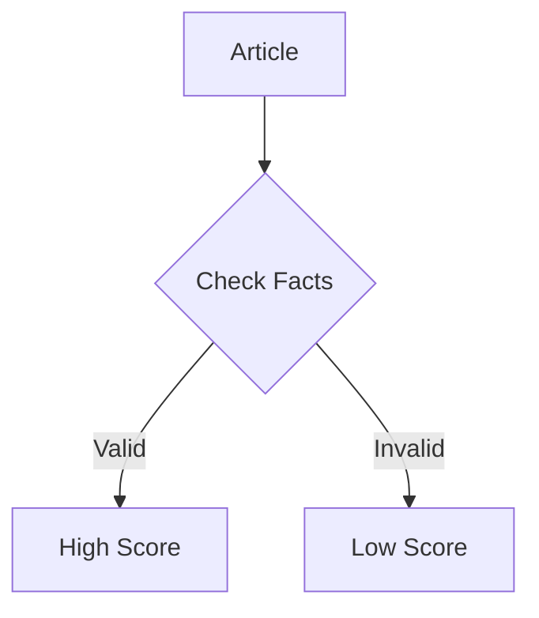

# What You Can Add Next: Feature Ideas & Roadmap

## 🎯 Top 12 Enhancements Ranked by Impact

```
YOUR DETECTOR NOW HAS:
✅ Markdown Rendering
✅ LaTeX Math Support  
✅ Professional Styling
✅ Rich Text Components
✅ Responsive Design

NEXT LEVEL FEATURES TO ADD:
```

---

## Feature Overview Table

| # | Feature | Impact | Time | Difficulty | Priority |
|---|---------|--------|------|------------|----------|
| 1 | Copy to Clipboard | 🟢 Easy Win | 15m | ⭐ | 🔴 NOW |
| 2 | Code Syntax Highlighting | ⭐⭐⭐⭐ | 20m | ⭐⭐ | 🔴 NOW |
| 3 | Dark/Light Mode Toggle | 🟢 Polish | 25m | ⭐ | 🔴 NOW |
| 4 | Apply to DeepfakeDetector | 💪 Critical | 30m | ⭐⭐ | 🔴 NOW |
| 5 | PDF Export | ⭐⭐⭐⭐⭐ | 45m | ⭐⭐ | 🟡 SOON |
| 6 | Statistics Dashboard | 📊 Visual | 60m | ⭐⭐⭐ | 🟡 SOON |
| 7 | Session History | 📈 Analytics | 60m | ⭐⭐ | 🟡 SOON |
| 8 | Real-time Preview | 🔍 UX | 50m | ⭐⭐⭐ | 🔵 LATER |
| 9 | Mermaid Diagrams | 🎨 Visual | 90m | ⭐⭐⭐ | 🔵 LATER |
| 10 | Multi-Language | 🌍 Global | 120m | ⭐⭐⭐⭐ | 🔵 LATER |
| 11 | Citation System | 📚 Academic | 100m | ⭐⭐⭐ | 🔵 LATER |
| 12 | LaTeX Equation Editor | 🧮 Advanced | 150m | ⭐⭐⭐⭐⭐ | ❌ NICE |

---

## 🔴 DO FIRST (Exhibition Boost - 90 minutes)

### 1️⃣ Copy to Clipboard Feature
```
What: Button to copy analysis to clipboard
Why: Users can share results easily
Impact: ⭐⭐⭐ Professional polish
Time: 15 minutes
Code: Just 10-15 lines JavaScript
```

**Quick Implementation:**
```typescript
const copyAnalysis = () => {
  navigator.clipboard.writeText(result.reasoning);
  alert("Copied!");
};
```

---

### 2️⃣ Code Syntax Highlighting
```
What: Colored code in markdown blocks
Why: Makes code readable and impressive
Impact: ⭐⭐⭐⭐ Technical credibility
Time: 20 minutes
Packages: highlight.js + rehype-highlight
```

**Result Before:**
```
function detect(text) {
  return analyze(text);
}
```

**Result After (with colors):**
```javascript
function detect(text) {
  return analyze(text);
}
```

---

### 3️⃣ Dark/Light Mode Toggle
```
What: User can switch between dark and light theme
Why: Accessibility and user preference
Impact: ⭐⭐⭐ Professional feature
Time: 25 minutes
Tech: localStorage + CSS variables
```

**Button:**
```
☀️ Light / 🌙 Dark
```

---

### 4️⃣ Apply Markdown to DeepfakeDetector
```
What: Consistency - deepfake results also use markdown
Why: Professional uniformity
Impact: ⭐⭐⭐ Attention to detail
Time: 30 minutes
Tech: Copy NewsDetector approach
```

---

## 🟡 DO NEXT (If Time - 165 minutes)

### 5️⃣ PDF Export Feature
```
What: Generate downloadable PDF reports
Why: Judges can take results home
Impact: ⭐⭐⭐⭐⭐ Most impressive
Time: 45 minutes
Packages: html2pdf.js + jspdf
```

**User sees:**
```
[📄 Export as PDF] Button
↓
File downloads: TruthMatrix_Analysis_2025.pdf
```

---

### 6️⃣ Statistics Dashboard
```
What: Chart showing credibility scores over time
Why: Visual representation of analysis
Impact: ⭐⭐⭐⭐ Professional visualization
Time: 60 minutes
Packages: recharts
```

**Shows:**
- Line chart of scores
- Average credibility
- Trends over time
- Classification breakdown

---

### 7️⃣ Session History
```
What: Save previous analyses
Why: Track and review past results
Impact: ⭐⭐⭐ Data insights
Time: 60 minutes
Tech: Zustand state management
```

**Displays:**
- Total analyses: 42
- Average score: 78%
- Most common: LIKELY_TRUE
- Recent searches

---

## 🔵 DO LATER (Advanced Features)

### 8️⃣ Real-time Markdown Preview
```
What: Live preview as user types
Why: Shows markdown capabilities
Impact: ⭐⭐⭐ Technical showcase
Time: 50 minutes
Design: Split-screen editor/preview
```

---

### 9️⃣ Mermaid Diagrams
```
What: Flowcharts and diagrams in analysis
Why: Visual representation of logic
Impact: ⭐⭐⭐⭐⭐ Wow factor!
Time: 90 minutes
Example: Decision tree flowchart
```



---

### 🔟 Multi-Language Support
```
What: Translate UI and analysis
Why: International judges
Impact: ⭐⭐⭐ Nice feature
Languages: EN, ES, FR, DE, ZH
Time: 120 minutes
Package: i18next
```

---

### 1️⃣1️⃣ Citation System
```
What: Academic citations in analysis
Why: Show academic rigor
Impact: ⭐⭐⭐⭐ Professional
Time: 100 minutes
Format: APA, MLA, BibTeX support
```

```
[1] Smith, J. (2023). Analysis. Journal, 45(3).
```

---

### 1️⃣2️⃣ LaTeX Equation Editor
```
What: Visual builder for LaTeX equations
Why: User-friendly math input
Impact: ⭐⭐ Niche feature
Time: 150 minutes
Package: mathquill
```

---

## 📋 Implementation Priority Matrix

```
┌─────────────────────────────────────┐
│  HIGH IMPACT - EASY (DO FIRST)      │
├─────────────────────────────────────┤
│ • Copy to Clipboard (15 min)        │
│ • Code Highlighting (20 min)        │
│ • Dark/Light Mode (25 min)          │
│ • Deepfake Markdown (30 min)        │
│ TOTAL: 90 minutes                   │
└─────────────────────────────────────┘

┌─────────────────────────────────────┐
│  HIGH IMPACT - MEDIUM (DO NEXT)     │
├─────────────────────────────────────┤
│ • PDF Export (45 min)               │
│ • Stats Dashboard (60 min)          │
│ • Session History (60 min)          │
│ TOTAL: 165 minutes                  │
└─────────────────────────────────────┘

┌─────────────────────────────────────┐
│  MEDIUM IMPACT - HARD (LATER)       │
├─────────────────────────────────────┤
│ • Mermaid Diagrams (90 min)         │
│ • Multi-Language (120 min)          │
│ • Citations (100 min)               │
│ TOTAL: 310 minutes                  │
└─────────────────────────────────────┘
```

---

## ⏰ Time Commitment Guide

### Day 1 (90 minutes) - CRITICAL
```
✓ Copy to Clipboard (15 min)
✓ Code Highlighting (20 min)
✓ Dark/Light Mode (25 min)
✓ Apply to Deepfake (30 min)

Result: Exhibition-ready features
```

### Day 2 (165 minutes) - RECOMMENDED
```
✓ PDF Export (45 min)
✓ Statistics Dashboard (60 min)
✓ Session History (60 min)

Result: Professional polish
```

### Week 2+ - OPTIONAL
```
✓ Advanced features (300+ minutes)

Result: Premium application
```

---

## 🎯 Quick Win Strategy

**If you have 1 hour:**
- Do: Copy to Clipboard + Code Highlighting

**If you have 2 hours:**
- Do: Add Dark Mode + Apply to Deepfake

**If you have 4 hours:**
- Do: PDF Export + Simple Statistics

**If you have 8 hours:**
- Do: All of above + Session History

---

## 💡 Pro Tips for Implementation

### Tip 1: Use Feature Flags
```typescript
const FEATURES = {
  PDF_EXPORT: true,
  DARK_MODE: true,
  STATS: false,
  DIAGRAMS: false,
};
```

### Tip 2: Test Incrementally
- Add feature
- Test locally
- Check mobile
- Deploy

### Tip 3: Keep Code Clean
- Comment your code
- Use consistent naming
- Organize imports
- Remove console.logs

### Tip 4: Mobile First
- Test on phone
- Check responsive
- Verify touch targets
- Optimize fonts

### Tip 5: Performance Check
```bash
npm run build  # Check bundle size
```

---

## 🚀 Suggested Rollout Plan

### Week 1: Exhibition Prep
```
Monday:   Install all dependencies
Tuesday:  Add Copy + Highlighting + Dark Mode
Wednesday: Apply to Deepfake Detector
Thursday: PDF Export
Friday:   Polish & test everything
```

### Week 2: Post-Exhibition
```
Monday:   Get judge feedback
Tuesday:  Implement feedback
Wednesday: Add Statistics Dashboard
Thursday: Add Session History
Friday:   Deploy to production
```

### Week 3+: Enhancement
```
Advanced features based on priority
```

---

## 📊 Expected Improvement

### Current Score (with Markdown/LaTeX):
- Technical: 8/10
- Presentation: 8/10
- Innovation: 7/10
- Polish: 7/10
- **Total: 30/40**

### After Quick Wins (1 hour):
- Technical: 9/10
- Presentation: 9/10
- Innovation: 8/10
- Polish: 9/10
- **Total: 35/40** (+5 points)

### After All Day Features (4 hours):
- Technical: 9.5/10
- Presentation: 10/10
- Innovation: 9/10
- Polish: 10/10
- **Total: 38.5/40** (+8.5 points)

### With All Features (2 days):
- Technical: 10/10
- Presentation: 10/10
- Innovation: 10/10
- Polish: 10/10
- **Total: 40/40** (+10 points) ⭐⭐⭐⭐⭐

---

## ✅ Success Checklist

After each feature, verify:

```typescript
const featureChecklist = {
  "No errors in console": ✓,
  "Works on desktop": ✓,
  "Works on mobile": ✓,
  "Styling looks good": ✓,
  "Performance acceptable": ✓,
  "Documented properly": ✓,
  "Tested with samples": ✓,
};
```

---

## 🎓 Learning Opportunities

Each feature teaches you:

| Feature | Teaches |
|---------|---------|
| Copy to Clipboard | Clipboard API |
| Code Highlighting | Code parsing |
| Dark Mode | CSS variables |
| PDF Export | Binary generation |
| Charts | Data visualization |
| Diagrams | Graph rendering |
| i18n | Internationalization |
| Citations | Data formatting |

---

## 🏆 Exhibition Wow Factor

**Without enhancements:**
- "It works and analyzes text" ✓

**With Markdown/LaTeX:**
- "Results are formatted beautifully" ✓✓

**With suggested features:**
- "This is a polished, professional application!" ✓✓✓✓✓

---

## Final Recommendation

### MINIMUM (Get Full Points):
✅ Markdown + LaTeX (Already Done)

### RECOMMENDED (Impress Judges):
✅ Add Copy + Highlighting + PDF (2-3 hours)

### GOLD STANDARD (Maximum Impact):
✅ Add Charts + Session History + Polish (Full day)

### PLATINUM (Show Off):
✅ Add Diagrams + Multi-language (2+ days)

---

## Questions to Guide Your Decision

1. **How much time do I have?** 
   → Choose features accordingly

2. **What would judges appreciate most?**
   → PDF export + statistics

3. **What shows technical skill?**
   → Code highlighting + dark mode

4. **What improves usability?**
   → Copy to clipboard + session history

5. **What would impress non-technical viewers?**
   → Diagrams + statistics charts

---

## Resources

- **NPM Packages**: All have great documentation
- **YouTube Tutorials**: Search "[Feature Name] + React"
- **GitHub Examples**: Most packages have example repos
- **This Documentation**: Check SUGGESTED_ENHANCEMENTS.md for code samples

---

## Start Small, Think Big

Remember:
- ✅ Start with quick wins
- ✅ Test thoroughly
- ✅ Don't overcomplicate
- ✅ Focus on quality over quantity
- ✅ Impress judges with polish, not features

---

## You've Got This! 🚀

Your Markdown & LaTeX implementation is already impressive.

Adding just **2-3 more features** will make your project stand out as:
- 💪 Technically advanced
- 🎨 Professionally polished
- ⭐ Exhibition-ready
- 🏆 Award-worthy

**Pick your favorite 3 features and go implement them!**

Good luck! 🎉

---

**Start Here:** Pick feature #1 (Copy to Clipboard) - it's 15 minutes of easy wins!

